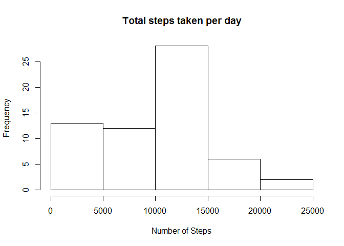
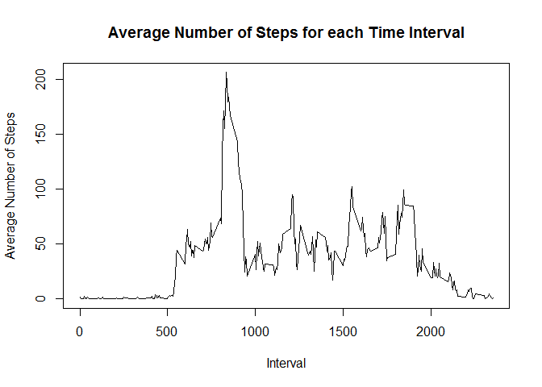
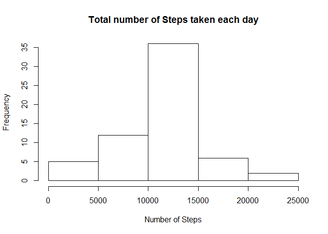
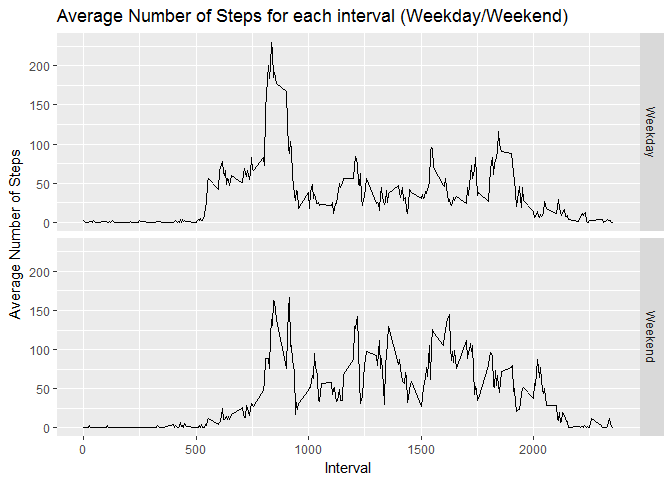

Activity Monitoring:
====================

Download the file and load the data into a dataframe:

    download.file("https://d396qusza40orc.cloudfront.net/repdata%2Fdata%2Factivity.zip","repdata_data_activity.zip")
    unzip("repdata_data_activity.zip")
    activity <- read.csv("activity.csv", sep=",", header=TRUE)

### Histogram of Total Number of Steps taken per day:

    steps_per_day <- aggregate(activity$steps, by = list(activity$date), "sum", na.rm=TRUE)
    colnames(steps_per_day) <- c("Date", "Total_Steps")
    plot <- hist(steps_per_day$Total_Steps, xlab = "Number of Steps", ylab = "Frequency", main= "Total steps taken per day")

### Mean and Median of the total number of steps taken per day:

    mean_steps <- mean(steps_per_day[,"Total_Steps"], na.rm=TRUE)
    mean_steps

    ## [1] 9354.23

    median_steps <- median(steps_per_day[,"Total_Steps"], na.rm = TRUE)
    median_steps

    ## [1] 10395

### Daily Average Activity Pattern

    average_steps <- aggregate(activity$steps, by = list(activity$interval), "mean", na.rm=TRUE)
    colnames(average_steps) <- c("Interval", "Steps")
    plot(average_steps$Interval, average_steps$Steps, xlab = "Interval", ylab="Average Number of Steps", main = "Average Number of Steps for each Time Interval", type="l")

### Interval with the maximum number of steps:

    max_steps <- subset(average_steps, average_steps$Steps==max(average_steps$Steps), select = Interval)
    max_steps

    ##     Interval
    ## 104      835

### Input Missing Values

The number of missing values in the dataset are:

    ## Generates a dataframe with all rows that have missing values
    missing_values <- subset(activity, is.na(activity$steps))
    nrow(missing_values)

    ## [1] 2304

New dataset with missing data filled with mean for the 5 minute
interval:

    ## Merge 'missing values' dataframe with 'average steps taken in a day' dataframe by the interval
    complete <- merge(missing_values, average_steps, by.x = "interval", by.y="Interval")
    complete_final <- subset(complete, select=c("Steps", "date", "interval"))
    colnames(complete_final) <- c("steps", "date", "interval")

    ## Original dataframe without the missing values
    activity_new <- subset(activity, !is.na(activity$steps))

    ## Combine both dataframes together
    final <- rbind(activity_new, complete_final)

    ## Dataframe with totals summed
    steps <- aggregate(final$steps, by=list(final$date), "sum")
    colnames(steps) = c("date","steps")

### Histogram of total number of steps taken each day

    hist(steps$steps, xlab = "Number of Steps", ylab ="Frequency", main = "Total number of Steps taken each day")

    mean_steps_final <- mean(steps[,"steps"])
    mean_steps_final

    ## [1] 10766.19

    median_steps_final <- median(steps[,"steps"])
    median_steps_final

    ## [1] 10766.19

### Difference in activity patterns between weekdays and weekends:

    final$day <- weekdays(as.Date(final$date))
    final$weekday_weekend <- factor(final$day, c("Weekday", "Weekend"))
    final$weekday_weekend <- ifelse(final$day == "Sunday" | final$day == "Saturday", "Weekend", "Weekday")

Average Number of Steps for weekdays and weekends

    library(ggplot2)

    average_steps_final <- aggregate(final$steps, by = list(final$interval, final$weekday_weekend), "mean")
    colnames(average_steps_final) <- c("interval", "day", "steps")
    ggplot(average_steps_final, aes(average_steps_final$interval, average_steps_final$steps)) + facet_grid(average_steps_final$day~.) + geom_line() + labs(title = "Average Number of Steps for each interval (Weekday/Weekend)", x = "Interval", y="Average Number of Steps")

